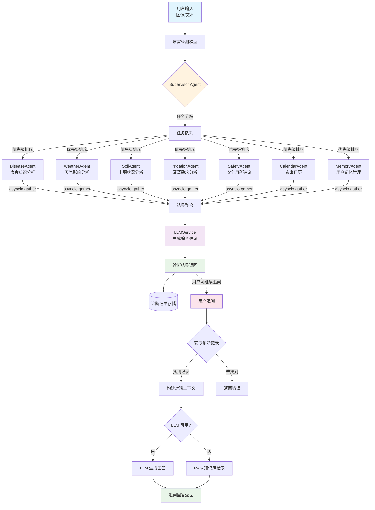

# 多智能体协作流程图

## 架构概览

本项目采用 **Supervisor + Specialist Agents** 模式，实现多智能体协作的番茄病虫害诊断系统。

## 流程图



## 流程说明

### 主流程（诊断）

```
用户输入 → 病害检测 → Supervisor 分解任务 → 7个Agent并行执行 → 结果聚合 → 生成建议 → 诊断结果返回
```

### 追问流程（Chat）

```
用户追问 → 获取诊断记录 → 构建对话上下文 → LLM生成回答（或RAG降级） → 追问回答返回
```

## 智能体清单

| 智能体 | 文件 | 职责 |
|--------|------|------|
| `SupervisorAgent` | `supervisor.py` | 中央编排：任务分解、优先级排序、并行调度 |
| `DiseaseAgent` | `disease_agent.py` | 病害知识分析（集成 RAG） |
| `WeatherAgent` | `weather_agent.py` | 气象影响分析 |
| `SoilAgent` | `soil_agent.py` | 土壤状况分析 |
| `IrrigationAgent` | `irrigation_agent.py` | 灌溉需求分析 |
| `SafetyAgent` | `safety_agent.py` | 农药推荐与安全审计 |
| `CalendarAgent` | `calendar_agent.py` | 农事日历与提醒 |
| `MemoryAgent` | `memory_agent.py` | 用户长期记忆管理 |

## 关键接口

| 接口 | 方法 | 说明 |
|------|------|------|
| `/diagnosis` | POST | 创建诊断（主流程） |
| `/chat` | POST | 用户追问（基于诊断结果） |

## 技术特点

- **并发模型**: `asyncio.gather` 并行执行
- **LLM 集成**: LangChain + 智谱 GLM-4
- **降级策略**: LLM 不可用时回退到 RAG/规则引擎
- **上下文关联**: 追问系统基于诊断记录构建对话上下文

## 相关文件

- `agents/supervisor.py` - Supervisor Agent 实现
- `agents/base_agent.py` - Agent 基类定义
- `api/routes.py` - API 路由（包含诊断和追问接口）
- `services/llm_service.py` - LLM 服务
